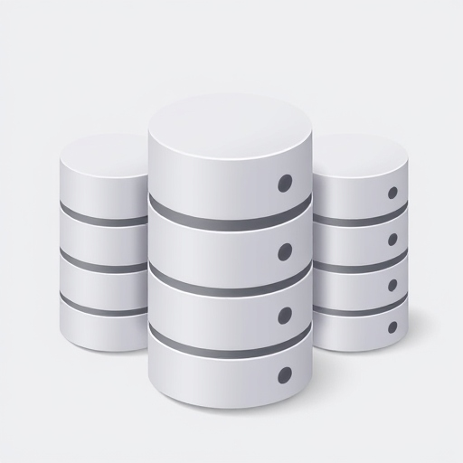

At first glance, combining a traditional SQL database with a NoSQL-style schema may seem counter-intuitive. However, this hybrid strategy is gaining traction as a practical way to harness the strengths of both relational and non-relational data models within a single system.

<!-- truncate -->

In this approach, unstructured or semi-structured data is stored inside a relational database without enforcing the rigid, predefined schemas typically associated with SQL. Instead of designing normalized tables with fixed columns and relationships, developers use flexible data types such as JSON or XML, often stored within a single column. Modern relational database management systems (RDBMS) like PostgreSQL, MySQL, and SQL Server have introduced first-class support for these document-based structures—enabling SQL databases to function partially as document stores.

## Why Use a Relational Database as a Document Store?

This hybrid model offers several key benefits:

1. **Leverage SQL Stability and Maturity:**
   Relational databases are robust, time-tested systems that offer transactional guarantees (ACID compliance), optimized query engines, and reliable backup and recovery mechanisms. By storing documents within this environment, teams can continue using familiar SQL tools and workflows, while avoiding the need to introduce and manage a separate NoSQL system.

2. **Flexible Data Modelling:**
   Storing JSON documents or key-value pairs inside SQL tables allows teams to handle dynamic, evolving, or schema-less data without rigid table structures. Use cases like user profiles, product catalogs, application metadata, or session data often benefit from a document-based approach, as their structures may vary frequently or contain optional fields.

3. **Simplified Architecture:**
   Maintaining a single database engine for both structured and semi-structured data can significantly reduce operational complexity. This eliminates the overhead of syncing data between systems, learning separate query languages, and managing different scaling or backup strategies.

4. **Schema Evolution Without Downtime:**
   In traditional SQL environments, altering schemas—such as adding new columns or changing table structures—can be disruptive, particularly in production. Document-based fields allow the data model to evolve more gracefully. Developers can add fields to JSON documents as needed, without requiring database migrations or affecting existing rows.

## Best Practices and Considerations

While this hybrid approach is powerful, it’s important to use it judiciously. Not all data is suited for document storage. When the data benefits from indexing, joins, or complex queries across fields, a normalized relational structure is still ideal. Additionally, querying deeply nested JSON structures may not perform as efficiently as traditional SQL joins, so performance testing is essential.

Furthermore, governance and validation must still be considered. Without a rigid schema, the responsibility shifts to the application layer to ensure data consistency and integrity within document fields.

## Conclusion

Using a relational database as a document store combines the best of both worlds: the reliability and structure of SQL with the flexibility of NoSQL. With support for JSON and other semi-structured formats becoming more widespread in modern RDBMS platforms, this hybrid model offers a practical solution for teams looking to streamline their data infrastructure without sacrificing power or control.

As with any architectural choice, the key lies in understanding your data and choosing the right tool—or combination of tools—for the job.
